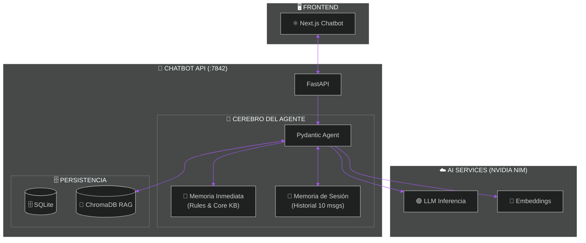
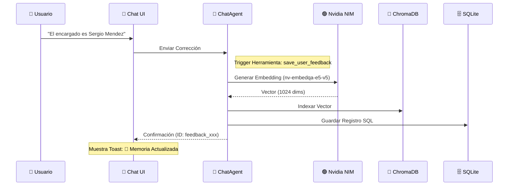

# 🧠 SmartHR AI Chatbot - Unified Knowledge System

> **Asistente Inteligente Unificado para el Sistema de Gestión de Personal (Web/React)**

Este proyecto implementa un **Chatbot Contextual Avanzado** diseñado para actuar como la capa de soporte y consulta inteligente del ecosistema **SmartHR**. A diferencia de un chatbot genérico, este asistente tiene conocimiento profundo y técnico sobre la lógica interna de la aplicación, incluyendo reglas de negocio, validaciones de formularios y estructuras de base de datos.

## 🚀 Características Principales

### 1. Conocimiento Técnico Profundo
El chatbot no solo responde preguntas generales, sino que entiende la **arquitectura interna** del sistema:
*   **Interfaces React/Next.js**: Conoce al detalle componentes como `ChatbotWidget`, dashboard de `Turnos`, `Asistencia`, etc.
*   **Lógica de Negocio**: Sabe, por ejemplo, que al guardar un empleado los nombres se convierten a MAYÚSCULAS o cómo el sistema gestiona los solapamientos de pausas.
*   **Base de Datos**: Entiende la relación entre modelos Pydantic (`Employee`, `Pause`) y tablas PostgreSQL (`empleado`, `pausas`).

### 2. Arquitectura Modular de Conocimiento
La inteligencia del bot se basa en archivos Markdown estructurados en `knowledge/modules/`, actuando como una "Single Source of Truth":
*   `pantallas.md`: Especificaciones técnicas de UI y lógica Swing.
*   `turnos.md`, `personal.md`: Reglas de negocio específicas por módulo.
*   `main.md`: Orquestador que integra todos los conocimientos.

### 3. Sistema de Memoria de Triple Capa (Hybrid RAG+)
El sistema utiliza una arquitectura de memoria avanzada para garantizar precisión y coherencia:
*   **Capa 1: Memoria Inmediata (System Prompt)**: Las reglas críticas y la lógica de Personal (`personal.md`) residen directamente en el prompt para una respuesta instantánea y sin errores.
*   **Capa 2: Memoria de Sesión (Short-term)**: El agente recuerda el hilo de la conversación actual (últimos 10 mensajes), permitiendo preguntas de seguimiento y contexto dinámico.
*   **Capa 3: Memoria Vectorial (RAG - ChromaDB)**: El conocimiento técnico masivo se recupera bajo demanda mediante búsqueda semántica usando `nvidia/nv-embedqa-e5-v5`.

### 4. Aprendizaje Orgánico (Feedback Loop)
El sistema puede **aprender de los usuarios** en tiempo real. Si un operador corrige al bot, el sistema valida, indexa vectorialmente y persiste la corrección en **SQLite** y **ChromaDB**, priorizándola en consultas futuras.

---

## 🛠️ Stack Tecnológico

*   **Core AI & Orquestación**: Python + [Pydantic AI](https://ai.pydantic.dev/).
*   **Modelos LLM/Embeddings**: **NVIDIA NIM** (Llama 3.3 70B & nv-embedqa-e5-v5).
*   **Bases de Datos**: 
    *   **ChromaDB**: Almacenamiento vectorial (RAG).
    *   **SQLite (SQLModel)**: Auditoría de feedback y metadatos.
*   **Backend API**: FastAPI.
*   **Frontend**: Next.js 14 + TailwindCSS.

---

## 🏗️ Arquitectura del Sistema

### Diagrama de Memoria Triple
Este diagrama muestra cómo el Agente interactúa con sus diferentes niveles de memoria y servicios externos.



### Flujo de Aprendizaje en Tiempo Real


> 📊 **Ver más diagramas**: Puedes consultar la documentación visual completa en [docs/architecture_diagrams.md](docs/architecture_diagrams.md).

---

## 📦 Estructura del Proyecto

```bash
/chatbot
├── app/                  
│   ├── infrastructure/   
│   │   ├── agent/        # Agente Pydantic AI & RAG
│   │   └── database/     # VectorStore & SQL Models
├── vector_db/            # 🧠 Base de Datos Vectorial (Persistente)
├── chatbot.db            # 🗄️ Base de Datos SQL (SQLite)
├── knowledge/            # 📚 Documentación Base (Markdown)
├── demo-next/            # 🖥️ Interfaz Web (Next.js)
└── main.py              
```

---

## 🏗️ Roadmap Técnico (Estado Actual)

- [x] **RAG Real**: Implementado con ChromaDB y Nvidia.
- [x] **Persistencia SQL**: Activa vía SQLModel.
- [x] **Feedback Reactivo**: Confirmaciones visuales en UI.
- [ ] **Admin Dashboard**: Panel para revisión de conocimientos (Próximamente).
- [ ] **Multi-Session Support**: Aislamiento de memoria por usuario.

