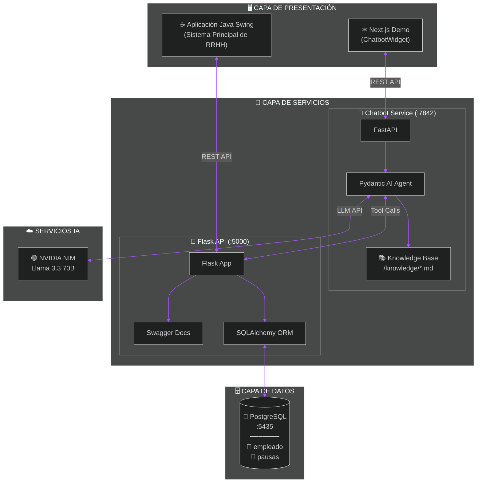
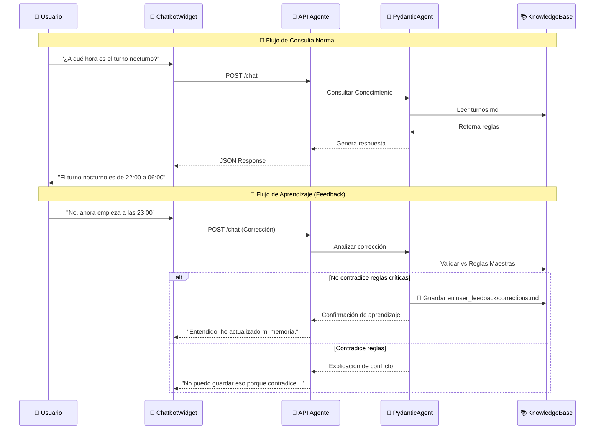

# 🧠 SmartHR AI Chatbot - Unified Knowledge System

> **Asistente Inteligente Unificado para el Sistema de Gestión de Personal (Java Swing)**

Este proyecto implementa un **Chatbot Contextual Avanzado** diseñado para actuar como la capa de soporte y consulta inteligente del ecosistema **SmartHR**. A diferencia de un chatbot genérico, este asistente tiene conocimiento profundo y técnico sobre la lógica interna de la aplicación de escritorio Java, incluyendo reglas de negocio, validaciones de formularios y estructuras de base de datos.

## 🚀 Características Principales

### 1. Conocimiento Técnico Profundo
El chatbot no solo responde preguntas generales, sino que entiende la **arquitectura interna** del sistema Java:
*   **Pantallas Java Swing**: Conoce al detalle pantallas como `BaseFirma`, `Personal`, `PausasActivas`, `Turnos`, etc.
*   **Lógica de Negocio**: Sabe, por ejemplo, que al guardar un empleado los nombres se convierten a MAYÚSCULAS o cómo el sistema auto-completa firmas olvidadas.
*   **Base de Datos**: Entiende la relación entre modelos Java (`Personals`, `Turnos`) y tablas PostgreSQL (`empleado`, `turno`).

### 2. Arquitectura Modular de Conocimiento
La inteligencia del bot se basa en archivos Markdown estructurados en `knowledge/modules/`, actuando como una "Single Source of Truth":
*   `pantallas.md`: Especificaciones técnicas de UI y lógica Swing.
*   `turnos.md`, `personal.md`: Reglas de negocio específicas por módulo.
*   `main.md`: Orquestador que integra todos los conocimientos.

### 3. Aprendizaje Orgánico (Feedback Loop)
El sistema puede **aprender de los usuarios**. Si un operador corrige al bot (ej: "El turno nocturno ahora empieza a las 22:00"), el sistema puede validar y registrar esta corrección en `user_feedback/corrections.md` sin alterar la base de conocimiento central, priorizando esta nueva información en futuras consultas.

---

## 🛠️ Stack Tecnológico

*   **Core AI**: Python + [Pydantic AI](https://ai.pydantic.dev/) (Agentes Inteligentes).
*   **Backend API**: FastAPI (Alto rendimiento, asíncrono).
*   **Frontend**: Next.js 14 + TailwindCSS (Interfaz moderna tipo Dashboard).
*   **Integración**: Mapeo lógico con sistema Legacy Java Swing.

---

## 🏗️ Arquitectura del Sistema

### Diagrama de Integración Global
Este diagrama muestra cómo interactúan el frontend (Next.js), el chatbot (FastAPI + Pydantic AI), la API heredada (Flask) y la base de datos.



### Flujo de Conversación y Feedback
El siguiente diagrama detalla cómo el chatbot procesa los mensajes y aprende de las correcciones del usuario en tiempo real.



> 📊 **Ver más diagramas**: Puedes consultar la documentación visual completa en [docs/architecture_diagrams.md](docs/architecture_diagrams.md), incluyendo diagramas de clases y detalles de la API Flask.

---

## 📦 Estructura del Proyecto

```bash
/chatbot
├── app/                  # Lógica del Agente y API
│   ├── application/      # Servicios (Feedback, Chat)
│   ├── infrastructure/   # Adaptadores (Markdown Loader)
│   └── interfaces/       # Endpoints FastAPI
├── knowledge/            # 🧠 CEREBRO DEL SISTEMA
│   ├── main.md           # Entrada principal
│   ├── modules/          # Módulos específicos (Personal, Turnos...)
│   └── user_feedback/    # Memoria de aprendizaje
├── demo-next/            # Interfaz Web (Chat UI)
└── main.py               # Punto de entrada del Server
```

---

## ⚡ Instalación y Ejecución

### Prerrequisitos
*   Python 3.10+
*   Node.js 18+

### 1. Backend (Python)
```bash
# Instalar dependencias
pip install -r requirements.txt

# Iniciar el servidor (Puerto 7842)
python main.py
```

### 2. Frontend (Next.js)
```bash
cd demo-next

# Instalar dependencias
npm install

# Iniciar servidor de desarrollo (Puerto 3000)
npm run dev
```

Una vez arriba, visita `http://localhost:3000` para interactuar con el asistente.

---

## 📖 Guía de Uso del Conocimiento

Para agregar o modificar conocimiento del bot, no toques el código Python. Simplemente edita los archivos Markdown en `knowledge/`:

1.  **Nueva Pantalla Java**: Agrega la documentación técnica en `knowledge/modules/pantallas.md`.
2.  **Nueva Regla de Negocio**: Edita el módulo correspondiente (ej: `turnos.md`).
3.  **Refactorización**: Si creas un nuevo archivo `.md`, asegúrate de incluirlo en `knowledge/main.md` usando la sintaxis `[include: modules/archivo.md]`.

---

## 🤝 Contribución
Las correcciones a la lógica de negocio deben hacerse directamente en los Markdowns. Las mejoras al "cerebro" (agente) se hacen en `app/infrastructure/agent/`.

