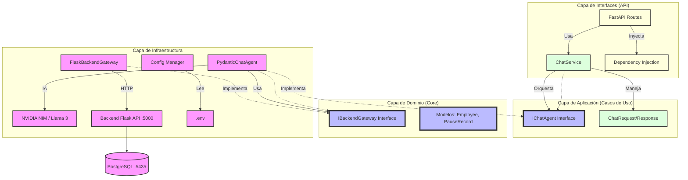

# Documentación Técnica: Chatbot Support Assistant (Clean Architecture)

## 🏗️ Arquitectura del Sistema

El sistema sigue los principios de **Arquitectura Limpia (Clean Architecture)** y **SOLID**, permitiendo un desacoplamiento total entre la lógica de negocio, la inteligencia artificial y las interfaces externas.

### 1. Capas del Proyecto

#### 🔹 Dominio (`app/domain/`)
Es el corazón de la aplicación. Contiene las reglas de negocio puras e interfaces (contratos).
- **Models**: Definiciones de datos (`Employee`, `PauseRecord`, `ChatRequest`).
- **Interfaces**: Define qué deben hacer los componentes externos (`IBackendGateway`, `IChatAgent`) sin especificar cómo.

#### 🔹 Aplicación (`app/application/`)
Contiene los casos de uso. Orquesta el flujo de datos desde y hacia las entidades del dominio.
- **ChatService**: Recibe un mensaje, consulta al agente y devuelve la respuesta formateada. Depende de las interfaces del dominio, no de implementaciones concretas.

#### 🔹 Infraestructura (`app/infrastructure/`)
Implementaciones concretas de las interfaces del dominio y herramientas externas.
- **Agent**: Implementación del agente usando `Pydantic AI` y modelos de `NVIDIA NIM`.
- **External**: `FlaskBackendGateway` maneja las peticiones HTTP a la API de Flask.
- **Common**: 
    - **Config**: Gestión de variables de entorno centrales.
    - **ContextLoader**: Sistema modular que carga instrucciones desde archivos Markdown (`/knowledge`) permitiendo inclusiones recursivas con `[include: file.md]`.

#### 🔹 Interfaces (`app/interfaces/`)
Adaptadores para la entrada y salida de datos (entregable).
- **API**: Controladores de FastAPI que exponen los endpoints REST.
- **Frontend (Component)**: `ChatbotWidget.jsx`, un componente React reutilizable que se integra en cualquier pantalla del sistema y envía el contexto dinámico (`current_screen`) al backend.

---

## 🛠️ Principios SOLID Aplicados

1.  **S - Single Responsibility**: Cada clase tiene una única razón para cambiar. El gateway solo conoce HTTP, el agente solo conoce prompts e IA, y el servicio solo conoce la orquestación.
2.  **O - Open/Closed**: Podemos agregar nuevos gateways (ej. MySQL o una nueva API) simplemente implementando `IBackendGateway` sin modificar el `ChatService`.
3.  **L - Liskov Substitution**: Cualquier implementación de `IChatAgent` puede ser usada por el servicio sin romper la funcionalidad.
4.  **I - Interface Segregation**: Las interfaces del dominio son específicas para las necesidades del sistema.
5.  **D - Dependency Inversion**: Los módulos de alto nivel (`ChatService`) no dependen de módulos de bajo nivel (`PydanticChatAgent`). Ambos dependen de abstracciones (`IChatAgent`).

---

## 🔌 Patrones de Diseño

- **Gateway**: `FlaskBackendGateway` actúa como un punto único de acceso a los datos externos de Flask.
- **Dependency Injection**: Usamos `Depends` de FastAPI para inyectar las implementaciones concretas en las rutas.
- **Strategy (implícito)**: El agente puede cambiar su comportamiento interno sin afectar al resto de la aplicación.

---

## 🚀 Guía de Ejecución

1. Asegúrate de tener las variables en `.env`.
2. Ejecuta el backend Flask (Puerto 5000).
3. Inicia el chatbot:
   ```bash
   python main.py
   ```
4. El sistema estará disponible en el puerto **7842**.

## 📊 Diagrama de Arquitectura


