# Documentación Técnica: Chatbot Support Assistant (Clean Architecture)

## 🏗️ Arquitectura del Sistema

El sistema sigue los principios de **Arquitectura Limpia (Clean Architecture)** y **SOLID**, permitiendo un desacoplamiento total entre la lógica de negocio, la inteligencia artificial y las interfaces externas.

### 1. Capas del Proyecto

#### 🔹 Dominio (`app/domain/`)
Es el corazón de la aplicación. Contiene las reglas de negocio puras e interfaces (contratos).
- **Models**: Definiciones de datos (`Employee`, `PauseRecord`, `ChatRequest`).
- **Interfaces**: Define qué deben hacer los componentes externos (`IBackendGateway`, `IChatAgent`) sin especificar cómo.

#### 🔹 Aplicación (`app/application/`)
Contiene los casos de uso. Orquesta el flujo de datos desde y hacia las entidades del dominio.
- **ChatService**: Recibe un mensaje, consulta al agente y devuelve la respuesta formateada. Depende de las interfaces del dominio, no de implementaciones concretas.

#### 🔹 Infraestructura (`app/infrastructure/`)
Implementaciones concretas de las interfaces del dominio.
- **Agent & Triple Memory**: 
    - **PydanticChatAgent**: El cerebro IA del sistema.
    - **Capa 1: Memoria Inmediata**: Módulos críticos (`personal.md`) cargados en el System Prompt para máxima fiabilidad.
    - **Capa 2: Memoria de Sesión**: Historial dinámico gestionado en memoria (RAM) para coherencia en la charla.
    - **Capa 3: Memoria RAG**: Búsqueda semántica en **ChromaDB** para manuales técnicos y feedback histórico.
- **Data Access**:
    - **SQLite (chatbot.db)**: Persistencia relacional para feedback y auditoría.
    - **ChromaDB (vector_db/)**: Base de datos de vectores para recuperación rápida (RAG).
- **External**:
    - **NVIDIA NIM Gateway**: Conexión con modelos LLM y de Embeddings (`nv-embedqa-e5-v5`).
    - **FlaskBackendGateway**: Conexión con el sistema legado.

---

## 🧠 Flujo de Memoria Unificado

1. **Sesión**: El sistema identifica al usuario y recupera su historial reciente.
2. **Consulta + RAG**: El usuario pregunta. Se genera un vector y se busca en **ChromaDB**.
3. **Fusión de Contexto**: Se combina el historial, el contexto RAG y las reglas maestras (System Prompt).
4. **Respuesta**: El LLM genera la respuesta con coherencia de conversación y base de conocimiento.

---

## 🚀 Guía de Ejecución

1. Asegúrate de tener las variables en `.env`.
2. Ejecuta el backend Flask (Puerto 5000).
3. Inicia el chatbot:
   ```bash
   python main.py
   ```

## 📊 Diagrama de Arquitectura Unificado (Triple Memoria)

```mermaid
%%{init: {'theme': 'base', 'themeVariables': { 'primaryColor': '#6366f1', 'primaryTextColor': '#fff', 'lineColor': '#a855f7', 'background': '#0f172a', 'mainBkg': '#1e293b'}}}%%
graph TD
    subgraph Frontend_Layer["🖥️ Capa de Presentación"]
        W["📱 Chatbot Widget<br/>(React/Next.js)"]
    end

    subgraph Chatbot_Engine["🤖 Chatbot Core (FastAPI)"]
        R["🛣️ API Routes"] --> SVC["💬 ChatService"]
        SVC --> AGENT["🧠 Pydantic Agent"]
        
        subgraph Memory_Stack["📚 Triple Memoria"]
            IMM["⚡ Inmediata<br/>(System Prompt)"]
            SESS["🕒 Sesión<br/>(Historial RAM)"]
            RAG["🗄️ Larga Duración<br/>(Vector Store)"]
        end
        
        AGENT --> IMM
        AGENT <--> SESS
        AGENT <--> RAG
    end

    subgraph External_AI["☁️ IA Externa"]
        NVIDIA["🟢 NVIDIA NIM API<br/>(Meta Llama)"]
    end

    subgraph Backend_Data["🔵 Backend & Datos"]
        FLASK["🔗 Flask API<br/>(Python)"]
        DB[("🐘 PostgreSQL<br/>(Real DB)")]
    end

    W <--> R
    AGENT <--> NVIDIA
    AGENT <--> FLASK
    FLASK <--> DB

    %% Estilos
    style W fill:#3b82f6,stroke:#1e40af,color:#fff
    style AGENT fill:#8b5cf6,stroke:#6d28d9,color:#fff
    style NVIDIA fill:#10b981,stroke:#065f46,color:#fff
    style FLASK fill:#0ea5e9,stroke:#0369a1,color:#fff
    style DB fill:#1e293b,stroke:#6366f1,color:#fff
```


