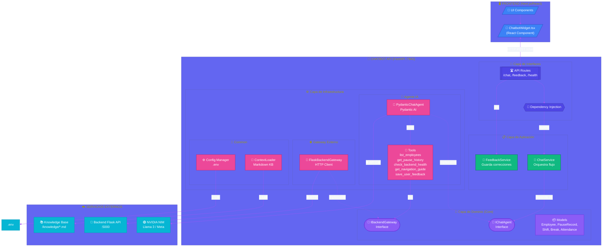
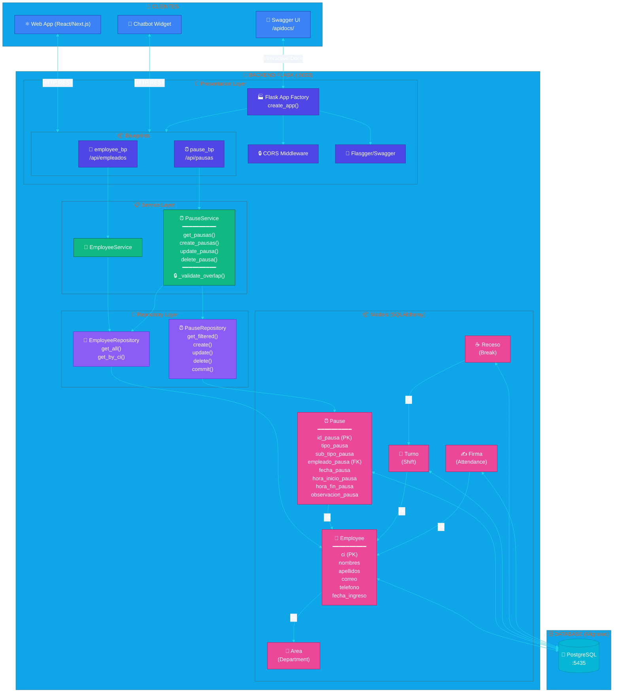
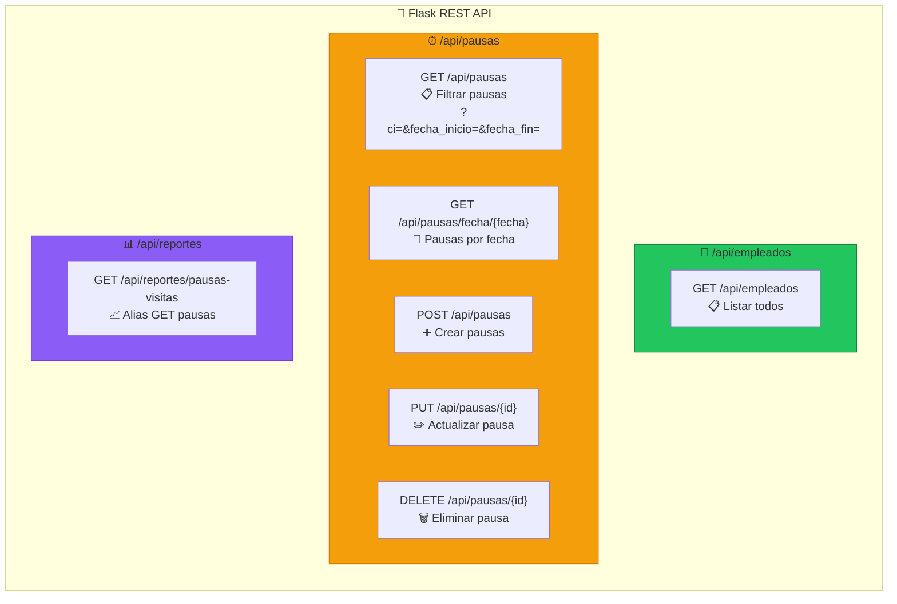
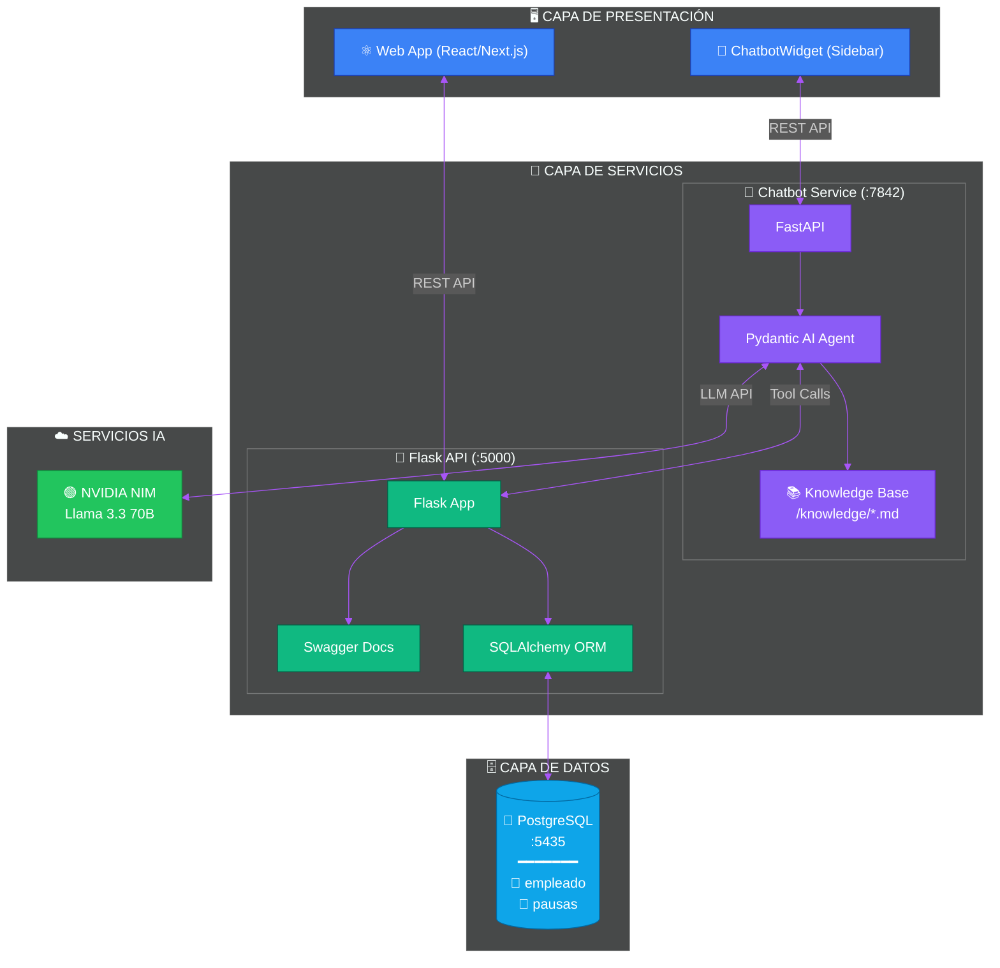

# 📊 Diagramas de Arquitectura del Sistema

Este documento contiene diagramas visuales de la arquitectura del **Chatbot** y la **API Flask** en formatos PlantUML y Mermaid.

---

# 🤖 ARQUITECTURA DEL CHATBOT (FastAPI + Pydantic AI)

## 📐 Diagrama en Mermaid - Arquitectura Clean del Chatbot

---

## 🎨 Diagrama en PlantUML - Arquitectura Clean del Chatbot

> **Tecnologías:** FastAPI, Pydantic AI, Next.js

---

## 📐 Diagrama de Secuencia Mermaid - Flujo de Chat

```mermaid
sequenceDiagram
    autonumber
    participant U as 👤 Usuario
    participant CW as 📱 ChatbotWidget
    participant API as 🛣️ FastAPI Routes
    participant CS as 💬 ChatService
    participant AG as 🤖 PydanticAgent
    participant NV as ☁️ NVIDIA NIM
    participant GW as 🔗 FlaskGateway
    participant FL as 🔵 Flask API

    rect rgb(30, 41, 59)
        Note over U,FL: 💬 Flujo de Conversación
        U->>+CW: Escribe mensaje
        CW->>+API: POST /chat<br/>{message, current_screen}
        API->>+CS: process_message(ChatRequest)
        CS->>+AG: get_response(message, screen)
        
        rect rgb(109, 40, 217)
            Note over AG,NV: 🧠 Procesamiento IA
            AG->>AG: Prepara contexto + KB
            AG->>+NV: API call (prompt + tools)
            
            alt Necesita datos del backend
                NV-->>AG: tool_call: list_employees
                AG->>+GW: get_employees()
                GW->>+FL: GET /api/empleados
                FL-->>-GW: [{id, name, role}...]
                GW-->>-AG: List[Employee]
                AG->>NV: tool_result
            end
            
            NV-->>-AG: Respuesta final
        end
        
        AG-->>-CS: response_text
        CS-->>-API: ChatResponse
        API-->>-CW: JSON {response}
        CW-->>-U: Muestra respuesta
    end

    rect rgb(21, 128, 61)
        Note over U,FL: 📝 Flujo de Feedback Orgánico
        U->>CW: Corrige información
        CW->>API: POST /chat (corrección)
        API->>CS: process_message
        CS->>AG: get_response
        AG->>AG: save_user_feedback tool
        AG->>AG: Guarda en /knowledge/user_feedback
        AG-->>CS: Confirmación
        CS-->>API: ChatResponse
        API-->>CW: "✅ Información guardada"
        CW-->>U: Muestra confirmación
    end
```

---

# 🔵 ARQUITECTURA DEL BACKEND FLASK

## 📐 Diagrama en Mermaid - API Flask (Pausas)

---

## 🎨 Diagrama en PlantUML - API Flask

> **Tecnologías:** Flask, SQLAlchemy, PostgreSQL

---

## 📊 Diagrama de Endpoints Mermaid

---

# 🔄 ARQUITECTURA INTEGRADA (Sistema Completo)

## 📐 Diagrama de Integración Mermaid

---

## 📌 Resumen de Puertos y Tecnologías

| Servicio | Puerto | Tecnología | Descripción |
|----------|--------|------------|-------------|
| **Chatbot API** | 7842 | FastAPI + Pydantic AI | Asistente conversacional con IA |
| **Flask API** | 5000 | Flask + SQLAlchemy | API REST de datos de pausas |
| **PostgreSQL** | 5435 | PostgreSQL | Base de datos principal |
| **NVIDIA NIM** | Cloud | Llama 3.3 70B | Motor de lenguaje natural |
| **Next.js Demo** | 3000 | Next.js + React | Frontend demo del widget |

---

*Documentación generada el 2026-02-07*
