# 📊 Diagramas de Arquitectura del Sistema

Este documento contiene diagramas visuales de la arquitectura del **Chatbot** y la **API Flask** en formatos PlantUML y Mermaid.

---

# 🤖 ARQUITECTURA DEL CHATBOT (FastAPI + Pydantic AI)

## 📐 Diagrama en Mermaid - Arquitectura Clean del Chatbot


---

## 🎨 Diagrama en PlantUML - Arquitectura Clean del Chatbot

```plantuml
@startuml Chatbot_Clean_Architecture
!theme cyborg-outline
skinparam backgroundColor #0f172a
skinparam defaultFontColor #f8fafc
skinparam ArrowColor #a855f7
skinparam ComponentBorderColor #6366f1
skinparam PackageBorderColor #4338ca
skinparam ClassBorderColor #8b5cf6
skinparam InterfaceBorderColor #22c55e
skinparam NoteFontColor #0f172a

title 🤖 Chatbot Support System - Clean Architecture\n<size:12>Port: 7842 | Python + FastAPI + Pydantic AI</size>

' === FRONTEND ===
package "🖥️ Frontend (Next.js)" as FRONTEND #1e3a5f {
    component "📱 ChatbotWidget.tsx" as CW #3b82f6
    component "🎨 CSS/Styling" as CSS #60a5fa
}

' === CHATBOT API ===
package "🤖 Chatbot API (FastAPI :7842)" as CHATBOT #1e293b {
    
    ' INTERFACES
    package "🔌 Interfaces Layer" as INTERFACES #f59e0b/fcd34d {
        component "🛣️ API Routes\n/chat\n/feedback\n/health" as ROUTES #f59e0b
        component "💉 Depends()\nDI Container" as DI #fbbf24
    }
    
    ' APPLICATION
    package "📋 Application Layer" as APPLICATION #22c55e/4ade80 {
        component "💬 ChatService\norchestrates flow" as CHAT_SVC #22c55e
        component "📝 FeedbackService\nsaves corrections" as FEED_SVC #4ade80
    }
    
    ' DOMAIN
    package "🎯 Domain Layer (Core)" as DOMAIN #8b5cf6/a78bfa {
        interface "IChatAgent" as IAGENT #8b5cf6
        interface "IBackendGateway" as IGW #a78bfa
        
        class "📦 Models" as MODELS #7c3aed {
            + ChatRequest
            + ChatResponse
            + Employee
            + PauseRecord
            + FeedbackRequest
            --
            + Turno (Shift)
            + Receso (Break)
            + Firma (Attendance)
            + Area (Department)
        }
    }
    
    ' INFRASTRUCTURE
    package "⚙️ Infrastructure Layer" as INFRASTRUCTURE #ec4899/f472b6 {
        
        package "🧠 Agent" as AGENT_PKG #db2777 {
            component "🤖 PydanticChatAgent\n(Pydantic AI)" as AGENT #ec4899
            
            note right of AGENT
                **Available Tools:**
                🔧 list_employees()
                🔧 get_pause_history()
                🔧 check_backend_health()
                🔧 get_navigation_guide()
                🔧 save_user_feedback()
            end note
        }
        
        package "🌐 External" as EXT_PKG #be185d {
            component "🔗 FlaskBackendGateway\nHTTP Client (httpx)" as FLASK_GW #f472b6
        }
        
        package "📁 Common" as COMMON_PKG #9d174d {
            component "⚙️ Config\n(.env loader)" as CONFIG #f9a8d4
            component "📄 ContextLoader\n(Markdown KB)" as CTX #fce7f3
        }
    }
}

' === EXTERNAL SERVICES ===
package "☁️ External Services" as EXTERNAL #0891b2/22d3ee {
    cloud "🟢 NVIDIA NIM\nLlama 3 API" as NVIDIA #22d3ee
    database "🔵 Flask API\n:5000" as FLASK_API #06b6d4
    storage "📚 Knowledge Base\n/knowledge/*.md" as KB #0ea5e9
    file ".env" as ENV #38bdf8
}

' === RELATIONSHIPS ===
CW --> ROUTES : HTTP POST /chat
CSS .. CW

ROUTES --> DI
ROUTES --> FEED_SVC
DI --> CHAT_SVC : inject

CHAT_SVC --> IAGENT : depends on
AGENT ..|> IAGENT : <<implements>>
FLASK_GW ..|> IGW : <<implements>>

AGENT --> NVIDIA : 🌐 LLM API
AGENT --> IGW : uses
FLASK_GW --> FLASK_API : 🌐 HTTP

CTX --> KB : 📖 reads
CONFIG --> ENV : 📖 reads

' === NOTES ===
note top of CHATBOT
    **Principios SOLID:**
    ✅ SRP: Cada clase tiene una sola responsabilidad
    ✅ OCP: Abierto a extensión (nuevos Gateways)
    ✅ LSP: Interfaces intercambiables
    ✅ ISP: Interfaces específicas
    ✅ DIP: Alto nivel depende de abstracciones
end note

@enduml
```

---

## 📐 Diagrama de Secuencia Mermaid - Flujo de Chat

```mermaid
sequenceDiagram
    autonumber
    participant U as 👤 Usuario
    participant CW as 📱 ChatbotWidget
    participant API as 🛣️ FastAPI Routes
    participant CS as 💬 ChatService
    participant AG as 🤖 PydanticAgent
    participant NV as ☁️ NVIDIA NIM
    participant GW as 🔗 FlaskGateway
    participant FL as 🔵 Flask API

    rect rgb(30, 41, 59)
        Note over U,FL: 💬 Flujo de Conversación
        U->>+CW: Escribe mensaje
        CW->>+API: POST /chat<br/>{message, current_screen}
        API->>+CS: process_message(ChatRequest)
        CS->>+AG: get_response(message, screen)
        
        rect rgb(109, 40, 217)
            Note over AG,NV: 🧠 Procesamiento IA
            AG->>AG: Prepara contexto + KB
            AG->>+NV: API call (prompt + tools)
            
            alt Necesita datos del backend
                NV-->>AG: tool_call: list_employees
                AG->>+GW: get_employees()
                GW->>+FL: GET /api/empleados
                FL-->>-GW: [{id, name, role}...]
                GW-->>-AG: List[Employee]
                AG->>NV: tool_result
            end
            
            NV-->>-AG: Respuesta final
        end
        
        AG-->>-CS: response_text
        CS-->>-API: ChatResponse
        API-->>-CW: JSON {response}
        CW-->>-U: Muestra respuesta
    end

    rect rgb(21, 128, 61)
        Note over U,FL: 📝 Flujo de Feedback Orgánico
        U->>CW: Corrige información
        CW->>API: POST /chat (corrección)
        API->>CS: process_message
        CS->>AG: get_response
        AG->>AG: save_user_feedback tool
        AG->>AG: Guarda en /knowledge/user_feedback
        AG-->>CS: Confirmación
        CS-->>API: ChatResponse
        API-->>CW: "✅ Información guardada"
        CW-->>U: Muestra confirmación
    end
```



---

# 🔵 ARQUITECTURA DEL BACKEND FLASK

## 📐 Diagrama en Mermaid - API Flask (Pausas)

```mermaid
%%{init: {'theme': 'base', 'themeVariables': { 'primaryColor': '#0ea5e9', 'primaryTextColor': '#fff', 'primaryBorderColor': '#0369a1', 'lineColor': '#22d3ee', 'secondaryColor': '#f1f5f9', 'tertiaryColor': '#0ea5e9', 'background': '#0c4a6e', 'mainBkg': '#164e63'}}}%%

graph TB
    subgraph CLIENTS["👥 CLIENTES"]
        REACT["⚛️ Web App (React/Next.js)"]
        CHAT_UI["🤖 Chatbot Widget"]
        SWAGGER["📖 Swagger UI<br/>/apidocs/"]
    end

    subgraph FLASK_APP["🔵 BACKEND FLASK (:5000)"]
        direction TB
        
        subgraph PRESENTATION["🔌 Presentation Layer"]
            direction LR
            APP["🏭 Flask App Factory<br/>create_app()"]
            CORS_MW["🔒 CORS Middleware"]
            SWAGGER_CFG["📖 Flasgger/Swagger"]
            
            subgraph BLUEPRINTS["📦 Blueprints"]
                EMP_BP["👥 employee_bp<br/>/api/empleados"]
                PAUSE_BP["⏰ pause_bp<br/>/api/pausas"]
            end
        end
        
        subgraph SERVICE["📋 Service Layer"]
            EMP_SVC["👥 EmployeeService"]
            PAUSE_SVC["⏰ PauseService<br/>━━━━━━━━━━<br/>get_pausas()<br/>create_pausas()<br/>update_pausa()<br/>delete_pausa()<br/>━━━━━━━━━━<br/>🔒 _validate_overlap()"]
        end
        
        subgraph REPOSITORY["💾 Repository Layer"]
            EMP_REPO["👥 EmployeeRepository<br/>get_all()<br/>get_by_ci()"]
            PAUSE_REPO["⏰ PauseRepository<br/>get_filtered()<br/>create()<br/>update()<br/>delete()<br/>commit()"]
        end
        
        subgraph MODELS["📦 Models (SQLAlchemy)"]
            EMP_MODEL["👤 Employee<br/>━━━━━━━━━━<br/>ci (PK)<br/>nombres<br/>apellidos<br/>correo<br/>telefono<br/>fecha_ingreso"]
            PAUSE_MODEL["⏰ Pause<br/>━━━━━━━━━━<br/>id_pausa (PK)<br/>tipo_pausa<br/>sub_tipo_pausa<br/>empleado_pausa (FK)<br/>fecha_pausa<br/>hora_inicio_pausa<br/>hora_fin_pausa<br/>observacion_pausa"]
            SHIFT_MODEL["📅 Turno<br/>(Shift)"]
            BREAK_MODEL["☕ Receso<br/>(Break)"]
            SIGN_MODEL["✍️ Firma<br/>(Attendance)"]
            AREA_MODEL["🏢 Area<br/>(Department)"]
        end
    end

    subgraph DATABASE["🗄️ DATABASE (Migrated)"]
        PG[("🐘 PostgreSQL<br/>:5435")]
    end

    %% Conexiones de clientes
    REACT <-->|"HTTP REST"| BLUEPRINTS
    CHAT_UI <-->|"HTTP REST"| BLUEPRINTS
    SWAGGER <-->|"Interactive Docs"| APP

    %% Flujo interno
    APP --> CORS_MW
    APP --> SWAGGER_CFG
    APP --> BLUEPRINTS

    EMP_BP --> EMP_SVC
    PAUSE_BP --> PAUSE_SVC

    EMP_SVC --> EMP_REPO
    PAUSE_SVC --> EMP_REPO
    PAUSE_SVC --> PAUSE_REPO

    EMP_REPO --> EMP_MODEL
    PAUSE_REPO --> PAUSE_MODEL
    
    PAUSE_MODEL -->|"FK"| EMP_MODEL
    SHIFT_MODEL -->|"FK"| EMP_MODEL
    BREAK_MODEL -->|"FK"| SHIFT_MODEL
    SIGN_MODEL -->|"FK"| EMP_MODEL
    EMP_MODEL -->|"FK"| AREA_MODEL

    EMP_MODEL <--> PG
    PAUSE_MODEL <--> PG
    SHIFT_MODEL <--> PG
    BREAK_MODEL <--> PG
    SIGN_MODEL <--> PG

    %% Estilos corregidos (Sin amarillo)
    classDef client fill:#3b82f6,stroke:#1e40af,color:#fff
    classDef presentation fill:#4f46e5,stroke:#3730a3,color:#fff
    classDef service fill:#10b981,stroke:#065f46,color:#fff
    classDef repository fill:#8b5cf6,stroke:#6d28d9,color:#fff
    classDef model fill:#ec4899,stroke:#be185d,color:#fff
    classDef database fill:#06b6d4,stroke:#0891b2,color:#fff

    class REACT,CHAT_UI,SWAGGER client
    class APP,CORS_MW,SWAGGER_CFG,EMP_BP,PAUSE_BP presentation
    class EMP_SVC,PAUSE_SVC service
    class EMP_REPO,PAUSE_REPO repository
    class EMP_MODEL,PAUSE_MODEL,SHIFT_MODEL,BREAK_MODEL,SIGN_MODEL,AREA_MODEL model
    class PG database
```



---

## 🎨 Diagrama en PlantUML - API Flask

```plantuml
@startuml Flask_API_Architecture
!theme cyborg-outline
skinparam backgroundColor #0c4a6e
skinparam defaultFontColor #f8fafc
skinparam ArrowColor #22d3ee
skinparam ComponentBorderColor #0ea5e9
skinparam PackageBorderColor #0369a1
skinparam ClassBorderColor #06b6d4
skinparam DatabaseBorderColor #0891b2

title 🔵 Backend Flask API - Sistema de Control de Pausas\n<size:12>Port: 5000 | Python + Flask + SQLAlchemy</size>

' === CLIENTS ===
package "👥 Clients" as CLIENTS #1e3a8a {
    actor "☕ Java Swing App" as JAVA #60a5fa
    actor "🤖 Chatbot API" as BOT #818cf8
    actor "📖 Swagger UI" as SWAG #a5b4fc
}

' === FLASK APP ===
package "🔵 Flask Backend (:5000)" as FLASK #164e63 {
    
    ' PRESENTATION
    package "🔌 Presentation Layer" as PRES #0d9488/5eead4 {
        component "🏭 App Factory\ncreate_app()" as FACTORY #14b8a6
        component "🔒 CORS Middleware" as CORS #2dd4bf
        component "📖 Flasgger\nSwagger Config" as FLASG #5eead4
        
        package "📦 Blueprints" as BP_PKG #0f766e {
            component "👥 employee_bp\nGET /api/empleados" as EMP_BP #10b981
            
            component "⏰ pause_bp" as PAUSE_BP #34d399 {
                note bottom
                    **Endpoints:**
                    GET  /api/pausas
                    GET  /api/pausas/fecha/{fecha}
                    POST /api/pausas
                    PUT  /api/pausas/{id}
                    DELETE /api/pausas/{id}
                end note
            }
        }
    }
    
    ' SERVICE
    package "📋 Service Layer" as SVC #7c3aed/a78bfa {
        class "👥 EmployeeService" as EMP_SVC #8b5cf6 {
            + get_all(): List[dict]
        }
        
        class "⏰ PauseService" as PAUSE_SVC #a78bfa {
            + get_pausas(ci, fecha_inicio, fecha_fin)
            + create_pausas(data): int
            + update_pausa(id, data): bool
            + delete_pausa(id): bool
            --
            - _validate_overlap(ci, fecha, h_inicio, h_fin)
        }

        class "📅 ShiftService" as SHIFT_SVC #a78bfa {
             + assign_shift(...)
        }
    }
    
    ' REPOSITORY
    package "💾 Repository Layer" as REPO #dc2626/f87171 {
        class "👥 EmployeeRepository" as EMP_REPO #ef4444 {
            + get_all(): List[Employee]
            + get_by_ci(ci): Employee
        }
        
        class "⏰ PauseRepository" as PAUSE_REPO #f87171 {
            + get_filtered(): List[Pause]
            + get_by_id(id): Pause
            + get_by_employee_date(): List[Pause]
            + create(data): Pause
            + update(id, data): Pause
            + delete(id): bool
            + commit()
        }

         class "📅 ShiftRepository" as SHIFT_REPO #f87171 {
            + CRUD Operations
        }
    }
    
    ' MODELS
    package "📦 Models (ORM)" as MDL #b45309/fbbf24 {
        class "👤 Employee" as EMP_MDL #f59e0b {
            **ci**: String (PK) 🔑
            --
            id_a: Integer
            id_t: Integer  
            id_b: Integer
            id_ba: Integer
            nombres: String(40)
            apellidos: String(40)
            direccion: String(254)
            telefonos: String(254)
            correo: String(40)
            fecha_nacimiento: Date
            fecha_ingreso: Date
            fecha_contrato: Date
            salario: Numeric(10,2)
            clave: String(254)
            --
            + to_dict(): dict
        }
        
        class "⏰ Pause" as PAUSE_MDL #fbbf24 {
            **id_pausa**: Integer (PK) 🔑
            --
            tipo_pausa: String(254)
            sub_tipo_pausa: String(254)
            **empleado_pausa**: String(254) (FK) 🔗
            observacion_pausa: String(254)
            fecha_pausa: Date
            hora_inicio_pausa: String(100)
            hora_fin_pausa: String(100)
            fecha_edicion: DateTime
            usuario_edicion: String(100)
            --
            + to_dict(): dict
        }

        class "📅 Turno" as SHIFT_MDL #fbbf24 {
            **id_turno**: PK
            --
            hora_inicio
            hora_fin
        }

        class "☕ Receso" as BREAK_MDL #fbbf24 {
            **id_receso**: PK
            --
            duracion
            tipo
        }

        class "✍️ Firma" as SIGN_MDL #fbbf24 {
             **id_firma**: PK
             --
             ingreso_jornada
             salida_break
        }
    }
}

' === DATABASE ===
database "🐘 PostgreSQL :5435\n(Migrado)" as PG #0891b2

' === RELATIONSHIPS ===
JAVA <--> EMP_BP : HTTP
JAVA <--> PAUSE_BP : HTTP
BOT <--> EMP_BP : HTTP
BOT <--> PAUSE_BP : HTTP
SWAG --> FACTORY : Docs

FACTORY --> CORS
FACTORY --> FLASG
FACTORY --> BP_PKG

EMP_BP --> EMP_SVC
PAUSE_BP --> PAUSE_SVC

EMP_SVC --> EMP_REPO
PAUSE_SVC --> EMP_REPO : validate exists
PAUSE_SVC --> PAUSE_REPO

EMP_REPO --> EMP_MDL
PAUSE_REPO --> PAUSE_MDL
SHIFT_REPO --> SHIFT_MDL

EMP_MDL <--> PG
PAUSE_MDL <--> PG
SHIFT_MDL <--> PG
BREAK_MDL <--> PG
SIGN_MDL <--> PG


' === NOTES ===
note top of FLASK
    **Patrón de Arquitectura:**
    📁 Repository Pattern
    📋 Service Layer Pattern
    🔌 Blueprint Registration
    📖 OpenAPI/Swagger
end note

@enduml
```

---

## 📊 Diagrama de Endpoints Mermaid


---

# 🔄 ARQUITECTURA INTEGRADA (Sistema Completo)

## 📐 Diagrama de Integración Mermaid


---

## 📌 Resumen de Puertos y Tecnologías

| Servicio | Puerto | Tecnología | Descripción |
|----------|--------|------------|-------------|
| **Chatbot API** | 7842 | FastAPI + Pydantic AI | Asistente conversacional con IA |
| **Flask API** | 5000 | Flask + SQLAlchemy | API REST de datos de pausas |
| **PostgreSQL** | 5435 | PostgreSQL | Base de datos principal |
| **NVIDIA NIM** | Cloud | Llama 3.3 70B | Motor de lenguaje natural |
| **Next.js Demo** | 3000 | Next.js + React | Frontend demo del widget |

---

*Documentación generada el 2026-02-07*
